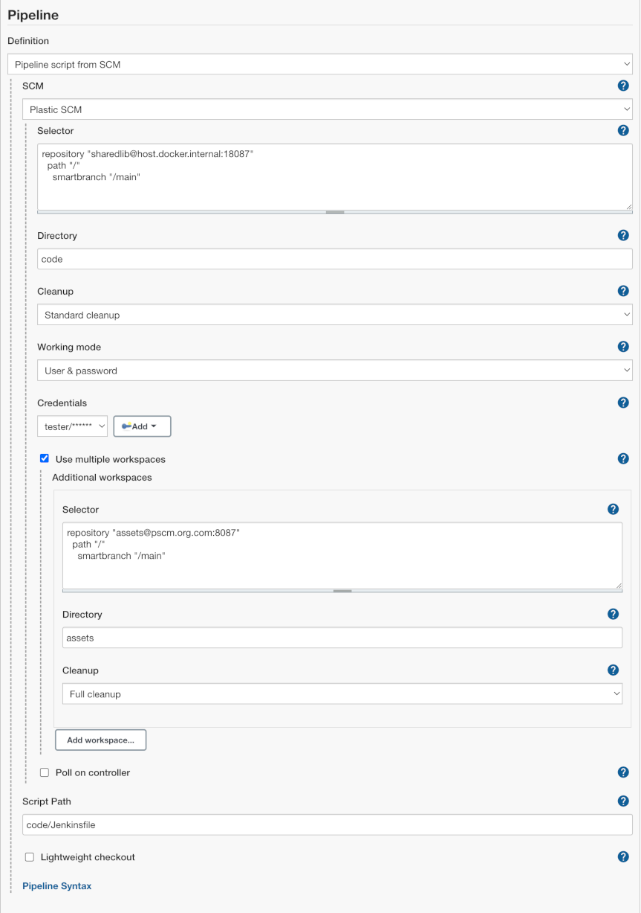
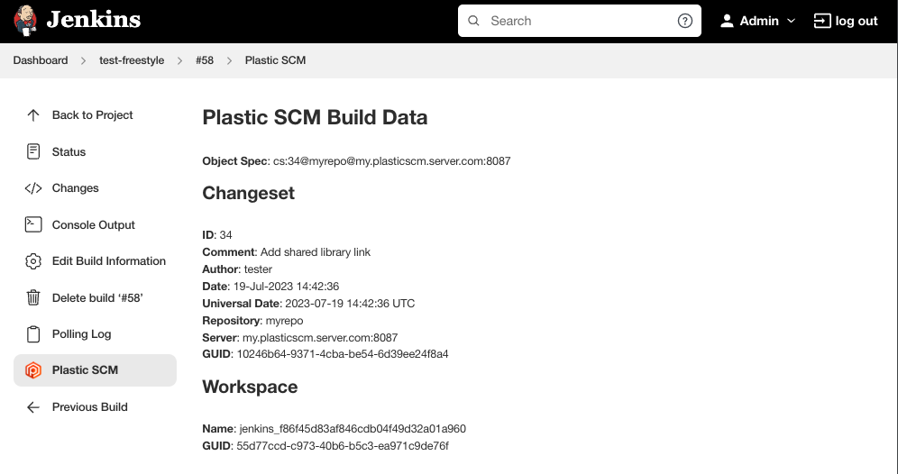

<h1 align="center">
    
</h1>

<p align="center">
    Retrieve and manage your Plastic SCM sources from Jenkins.
</p>

---


[](https://ci.jenkins.io/job/Plugins/job/plasticscm-plugin/job/master/)


## Configuration
### System configuration

In order to configure the plugin, you need the `cm` executable installed in the Jenkins server
machine. Then, please follow these steps:

1. Open the system configuration page "Manage Jenkins" and navigate to "Configure System"
2. Scroll down to the "Plastic SCM" section and enter the path where the `cm` executable (CLI
   client) is located
3. Click "Check" to verify that the path you set is correct
4. You can leave the field empty: "`cm`" will be used by default (i.e. the executable will be
   loaded from `$PATH`)


## Job configuration
### Freestyle projects

Scroll down to the Source Code Management section and select "Plastic SCM" (see screenshot below).
You'll need to enter a valid **selector**, which will be used to check out the repository contents
in every build. The "Poll SCM" trigger also uses that selector.

Every build will ensure that the Jenkins workspace contains a Plastic SCM before starting the
`cm update` operation. If you'd like to create the Plastic SCM workspace in a particular
subdirectory under the Jenkins job workspace, you can specify one in the **Subdirectory** field.
This field is mandatory if you want to use multiple workspaces.

If you want to keep the workspace between builds, check the **Use update box**. Otherwise, the
Plastic SCM workspace and its contents will be deleted before each build.


### Selector format

The selector accepts branches, changesets or labels. You can setup not only branches (which is the
normal case), but labels as well as changesets in the selector.

**Branch selector:**
```
repository "myRepo@my.plasticscm.server.com:8087"
  path "/"
    smartbranch "/main/scm1773"
```

**Changeset selector:**
```
repository "myRepo@my.plasticscm.server.com:8087"
  path "/"
    smartbranch "/main/scm1773" changeset "7030383"
```

**Label selector:**
```
repository "myRepo@my.plasticscm.server.com:8087"
  path "/"
    label "1.0.32-preview_997"
```

You can also use build parameters in the selector.
Example: Let's say that you defined two build parameters in your project:

* `branchname` - default value (/main)
* `repositoryname` - default value (default)

Then you can use those parameters in the Plastic SCM selector using the macro pattern
`$parameter_name`:

```
repository '$repositoryname'
    path "/"
        smartbranch '$branchname'
```

### Multiple workspaces

The Plastic SCM plugin allows you to checkout multiple workspaces in a single Jenkins workspace.
This can be useful if you need to fetch sources from two or more repositories in order to build your
application.

To enable this feature, check the **Use multiple workspaces** box in the SCM configuration. You'll
see a new button "Add workspace..." to append a new workspace to the list of additional workspaces.
The configuration settings are identical to the root ones.


⚠ Be careful! ⚠ This setup requires you to specify a subdirectory value **for all
workspaces**, and they must be different from one another. If you don't, you might risk having the
plugin download the contents from two or more repositories into the same directory.

### Pipelines

If you use scripted pipelines or you want to specify the pipeline script directly in the job
configuration, you can take advantage of the cm command inside the groovy script:

**cm command syntax:**
```groovy
cm branch: '<full-branch-name>', repository: '<rep-name>', server: '<server-address>:<server-port>, useUpdate: (true|false), directory: '<subdirectory-name>'
```

As you see, there's a one-to-one parameter mapping. To use multiple workspaces you simply need to
add multiple `cm` statements, paying attention to the value of the `directory` parameter.

**cm command example**
```groovy
cm branch: '/hotfix', repository: 'assets-repo', server: 'my.plasticscm.server.com:8087', useUpdate: true, directory: 'assets'
```

If you'd rather use declarative pipelines (selecting the **Pipeline script from SCM** option),
you'll have to specify the Plastic SCM configuration just as you'd do for a freestyle project. Then,
two new parameters will appear: **Script path** and **Lightweight checkout**.


The script path tells Jenkins where to find the pipeline script file. **This path is relative to the
Jenkins workspace!** So, if you defined subdirectories (regardless of how many additional
repositories you described) you'll need to include the subdirectory in the Script path. See an
example below:



Enabling **lightweight checkout** lets Jenkins retrieve the pipeline script file directly, without a
full Plastic SCM update.

## Build information
### Summary

The build summary includes a reference to the Plastic SCM changeset spec that was built.


### Changes list

The changes page in each build will have details about each of the changesets that were included in
the build, linked from the summary list.


### Plastic SCM Build Data

You'll find a link in the build page sidebar to display the Plastic SCM data for that build.



### Environment variables

If the checkout operation succeeds, these environment variables will be populated with the
appropriate values for the build:

1. `PLASTICSCM_CHANGESET_ID`: Number of the currently built changeset
2. `PLASTICSCM_CHANGESET_GUID`: GUID of the currently built changeset
3. `PLASTICSCM_BRANCH`: Name of the branch in Plastic SCM
4. `PLASTICSCM_AUTHOR`: Name of the user who created the currently build changeset
5. `PLASTICSCM_REPSPEC`: The configured repository specification for the current build

Additional workspaces will include their position in the list, like this:

1. `PLASTICSCM_1_CHANGESET_GUID`
2. `PLASTICSCM_5_AUTHOR`
3. `PLASTICSCM_9_CHANGESET_ID`
4. etc.

## Requirements

* Jenkins `2.60.3` or newer
* Plastic SCM command line client `8.0.16.3400` or newer

## Upgrading from 2.x to 3.x

The upgrade process is mostly seamless. You'll only need to review the configuration parameters of
your jobs **if you configured them to use multiple workspaces**. Since the subdirectory name was
inferred from the workspace name before and that parameter is now gone, the **Subdirectory**
parameter (used now to specify the subdirectory name explicitly) will be empty. Builds might
download all workspaces in the same directory!

## Development

### Building the Plugin

To build the plugin you will need
* [Maven](https://maven.apache.org/) version `3.5` or newer
* [Java Development Kit (JDK)](https://jdk.java.net/) version `8`

Run the following command to build the plugin
```shell
mvn package
```

### Contributing to the Plugin

New feature requests and bug fix proposals should be submitted as
[pull requests](https://help.github.com/en/articles/creating-a-pull-request).
Fork the repository. Make the desired changes in your forked copy. Submit a pull request to the
`master` branch.

Use the [Jenkins SCM API coding style guide](https://github.com/jenkinsci/scm-api-plugin/blob/master/CONTRIBUTING.md#code-style-guidelines)
for new code.

Before submitting a pull request please check if your code passes code quality and style checks by
running
```shell
mvn verify
```

All pull requests will be evaluated by
[Jenkins CI](https://ci.jenkins.io/job/Plugins/job/plasticscm-plugin/).


## Plugin information

This plugin is developed and maintained by Codice Software S.L., owner of the Plastic SCM product.

Visit us at https://www.plasticscm.com

You can meet the team [here](https://www.plasticscm.com/company/team)!

We really appreciate PR and contributions!

Feel the power of merging branches easier than ever with [SemanticMerge](https://semanticmerge.com)!

## Change log
You can find it [here](CHANGELOG.md)
