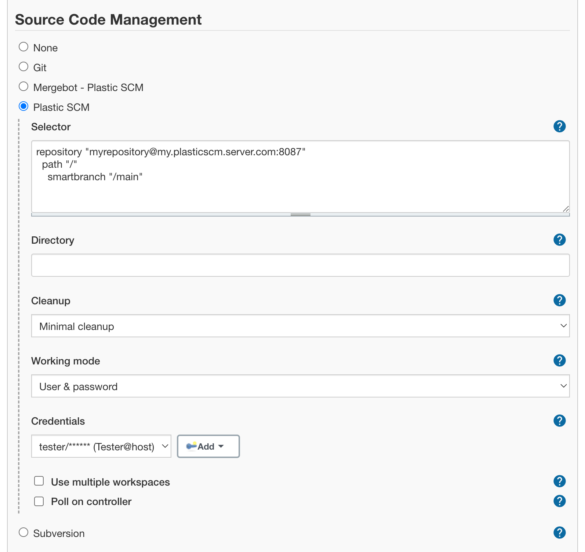
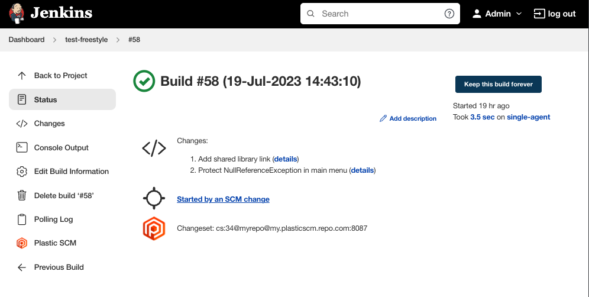

<h1 align="center">
    
</h1>

<p align="center">
    Retrieve and manage your Plastic SCM sources from Jenkins.
</p>

---


[](https://ci.jenkins.io/job/Plugins/job/plasticscm-plugin/job/master/)


## Configuration

### External tool configuration

The Plastic SCM plugin for Jenkins requires a working `cm` client to be present in the controller or agent machines.
If it's not, the plugin provides a way for the machines to automatically download and install the client.

To configure the Plastic SCM tool in Jenkins, open the system configuration page "Manage Jenkins" and navigate to
"Global Tool Configuration".

Scroll down to the "Plastic SCM" section. There will be a default entry called "Default". It will expect a `cm` binary
to be present in the controller or agents. If it's not, it will download it from [plasticscm.com](https://www.plasticscm.com/).

You can change the name to whatever you want. If there isn't any tool called "Default", the plugin will use the first
one in the list.

The field "Path to Plastic SCM executable" can be either an executable name or a full path. If you specify just the name,
the plugin will use the `$PATH` environment variable to run it. Leaving this field empty will use the `cm` default value.

You can optionally enable the Use .NET invariant globalization option if you're using the newer .NET Core CLI client
in Linux machines or containers that don't have the ICU packages installed.

The "Install automatically" option is checked by default, and the plugin automatically provides an installer to download
the `cm` client bundle from [plasticscm.com](https://www.plasticscm.com/) automatically. However, that installer will
**not** run if it detects that the tool defines a valid `cm` for the target machine. You can optionally override that by
checking the "Ignore system tool" option.

This automatic installer will save the tool bundle contents under `$JENKINS_ROOT/tools/plasticscm/$TOOL_NAME`.

At this point, the plugin is only capable of downloading the latest version available in the Plastic SCM website.


## Job configuration

### Freestyle projects

Scroll down to the Source Code Management section and select "Plastic SCM" (see screenshot below).
You'll need to enter a valid **selector**, which will be used to check out the repository contents
in every build. The "Poll SCM" trigger also uses that selector.

Every build will ensure that the Jenkins workspace contains a Plastic SCM before starting the
`cm update` operation. If you'd like to create the Plastic SCM workspace in a particular
subdirectory under the Jenkins job workspace, you can specify one in the **Directory** field.
This field is mandatory if you want to use multiple workspaces.

The _Cleanup_ value will determine what to do with the Plastic SCM workspace before checking out
the code. It has four possible values:

* **Minimal cleanup** will simply undo any changed files in the workspace directory and then run
  a workspace update. It's equivalent to enabling _Use update_ in older versions.
* **Standard cleanup** will undo changed files and also remove any private files that might be
  present in the workspace directory. Ignored files aren't affected. This is the recommended
  setting.
* **Full cleanup** has the same behavior as _Standard cleanup_ but removes ignored files as well.
* **Delete workspace** will remove the entire workspace contents and create a new one. Useful if you
  absolutely want to start every build from scratch. It might increase the build time if your
  workspace is big, though. It's equivalent to disabling _Use update_ in older versions.

You can also define specific credentials to be used by Plastic SCM in the context of the job. You can select the
target working mode, which can be one of these:

* **Use system configuration**
  * Don't specify credentials for this job, rely on an existing `client.conf` file in the machine.
* **User & password**
  * If your targeted Plastic SCM Server uses Plastic SCM user/password authentication, this is the option to choose.
* **LDAP / Cloud**
  * The appropriate choice if your targeted Plastic SCM Server is a Plastic Cloud organization or it uses LDAP as
    authentication provider.

Then, for _User & password_ and _LDAP / Cloud_ you need to specify credentials using the Jenkins Credentials API.



### Selector format

The selector accepts branches, changesets or labels. You can setup not only branches (which is the
normal case), but labels as well as changesets in the selector.

**Branch selector:**

```text
repository "myRepo@my.plasticscm.server.com:8087"
  path "/"
    smartbranch "/main/scm1773"
```

**Changeset selector:**

```text
repository "myRepo@my.plasticscm.server.com:8087"
  path "/"
    smartbranch "/main/scm1773" changeset "7030383"
```

**Label selector:**

```text
repository "myRepo@my.plasticscm.server.com:8087"
  path "/"
    label "1.0.32-preview_997"
```

**Important!** Don't forget to use the `ssl://` prefix in the server name if your Plastic
Server utilizes SSL. For instance, `repository "myRepo@ssl://my.plasticscm.server.com:8088"`

You can also use build parameters in the selector.
Example: Let's say that you defined two build parameters in your project:

* `branchname` - default value (/main)
* `repositoryname` - default value (default)

Then you can use those parameters in the Plastic SCM selector using the macro pattern
`$parameter_name`:

```text
repository '$repositoryname'
    path "/"
        smartbranch '$branchname'
```

### Multiple workspaces

The Plastic SCM plugin allows you to checkout multiple workspaces in a single Jenkins workspace.
This can be useful if you need to fetch sources from two or more repositories in order to build your
application.

To enable this feature, check the **Use multiple workspaces** box in the SCM configuration. You'll
see a new button "Add workspace..." to append a new workspace to the list of additional workspaces.
The configuration settings are identical to the root ones.


⚠ Be careful! ⚠ This setup requires you to specify a subdirectory value **for all
workspaces**, and they must be different from one another. If you don't, you might risk having the
plugin download the contents from two or more repositories into the same directory.

### Poll on controller

The Plastic SCM supports polling for repository changes. Polling is normally done
on the agent that performed the last build, but you can choose to run the polling directly
on the controller instead. This puts more work on the controller, but it makes polling work
reliably in situations where the agents come and go; for example, when agents are
provisioned on-demand in a Kubernetes cluster.

Since polling on the controller will invoke `cm` directly on the controller, the tool must have
its configuration within the `.plastic4` folder, just like on the agents.

### Pipelines

If you use scripted pipelines or you want to specify the pipeline script directly in the job
configuration, you can take advantage of the cm command inside the groovy script:

**cm command syntax:**

```groovy
cm(
    branch: '<full-branch-name>',
    changeset: '<cset-number>', // optional
    repository: '<rep-name>',
    server: '<server-address>:<server-port>',
    cleanup: '<cleanup-strategy>'
    directory: '<subdirectory-name>' // optional
)
```

As you see, there's a one-to-one parameter mapping. To use multiple workspaces you simply need to
add multiple `cm` statements, paying attention to the value of the `directory` parameter.

You only need to specify the `changeset` parameter if you'd like all builds to target that changeset.

The available values for `cleanup` are `MINIMAL`, `STANDARD`, `FULL` and `DELETE`.

In case you want to specify credentials, the available values for `workingMode` are `NONE` (default), `UP` and `LDAP`.
You might need to specify a string value in

**cm command examples:**

```groovy
cm(
    branch: '/hotfix',
    repository: 'assets-repo',
    server: 'my.plasticscm.server.com:8087',
    cleanup: 'DELETE',
    directory: 'assets',
    workingMode: 'UP',
    credentialsId: 'my-credentials'
)

cm(
    branch: '/dev',
    changeset: '538',
    repository: 'assets-repo',
    server: 'my.plasticscm.server.com:8087',
    cleanup: 'STANDARD',
)
```

**Important!** Don't forget to use the `ssl://` prefix in the server name if your Plastic
Server utilizes SSL. For instance, `server: 'ssl://my.plasticscm.server.com:8088',`

If you'd rather use declarative pipelines (selecting the **Pipeline script from SCM** option),
you'll have to specify the Plastic SCM configuration just as you'd do for a freestyle project. Then,
two new parameters will appear: **Script path** and **Lightweight checkout**.


The script path tells Jenkins where to find the pipeline script file. If you defined subdirectories (regardless of how 
many additional repositories you described) there are two possible scenarios: 
- If **Lightweight checkout** is selected the file is checked-out from the repository alone and placed in the root path, 
so you just need to specify the relative path to the script file within the repository.
  e.g. "Jenkinsfile" (if Jenkinsfile is in the root of the repository)
- Alternatively, if you don't select **Lightweight checkout** you'll need to include the subdirectory in the Script path
as the repository is downloaded entirely before looking for the script file.
  e.g. "code/Jenkinsfile" (if "code" specified in Directory field). See an example below:


Enabling **lightweight checkout** lets Jenkins retrieve the pipeline script file directly, without a
full Plastic SCM update.

## Build information

### Summary

The build summary includes a reference to the Plastic SCM changeset spec that was built.



### Changes list

The changes page in each build will have details about each of the changesets that were included in
the build, linked from the summary list.


### Plastic SCM Build Data

You'll find a link in the build page sidebar to display the Plastic SCM data for that build.


### Environment variables

If the checkout operation succeeds, these environment variables will be populated with the
appropriate values for the build:

1. `PLASTICSCM_CHANGESET_ID`: Number of the currently built changeset
2. `PLASTICSCM_CHANGESET_GUID`: GUID of the currently built changeset
3. `PLASTICSCM_BRANCH`: Name of the branch in Plastic SCM
4. `PLASTICSCM_AUTHOR`: Name of the user who created the currently build changeset
5. `PLASTICSCM_REPSPEC`: The configured repository specification for the current build

Additional workspaces will include their position in the list, like this:

1. `PLASTICSCM_1_CHANGESET_GUID`
2. `PLASTICSCM_5_AUTHOR`
3. `PLASTICSCM_9_CHANGESET_ID`
4. etc.

#### Pipelines

Please have in mind that running the `cm` command in a pipeline script won't automatically set the
environment variables above! This command, as do all VCS commands, returns a dictionary that
contains the environment values set as expected.

To take advantage of that, you should do something like this:

```groovy
pipeline {
  agent any

  environment {
    PLASTICSCM_WORKSPACE_NAME = "${env.JOB_BASE_NAME}_${env.BUILD_NUMBER}"
    PLASTICSCM_TARGET_SERVER = "192.168.1.73:8087"
    PLASTICSCM_TARGET_REPOSITORY = "default"
  }

  stages {
    stage('SCM Checkout') {
      steps {
        script {
          def plasticVars = cm(
            branch: "main",
            changelog: true,
            repository: env.PLASTICSCM_TARGET_REPOSITORY,
            server: env.PLASTICSCM_TARGET_SERVER,
            useUpdate: false
          )

          plasticVars.each {
            key, value -> println("${key} = ${value}")
          }
        }
      }
    }
  }
}
```

In the code above, the `plasticVars` dictionary would only be available in the `script` block
inside the 'SCM Checkout' stage. If you'd like access it across different scripts, steps or stages,
you can define the variable in the global scope:

```groovy
def plasticVars

pipeline {
  agent any

  environment {
    PLASTICSCM_WORKSPACE_NAME = "${env.JOB_BASE_NAME}_${env.BUILD_NUMBER}"
    PLASTICSCM_TARGET_SERVER = "192.168.1.73:8087"
    PLASTICSCM_TARGET_REPOSITORY = "default"
  }

  stages {
    stage('SCM Checkout') {
      steps {
        script {
          plasticVars = cm(
            branch: "main",
            changelog: true,
            repository: env.PLASTICSCM_TARGET_REPOSITORY,
            server: env.PLASTICSCM_TARGET_SERVER,
            useUpdate: false
          )
        }

        script {
          plasticVars.each {
            key, value -> println("${key} = ${value}")
          }
        }
      }
    }
  }
}
```

## Requirements

* Jenkins `2.60.3` or newer
* Plastic SCM command line client `10.0.16.6112` or newer

## Upgrading from 2.x to 3.x

The upgrade process is mostly seamless. You'll only need to review the configuration parameters of
your jobs **if you configured them to use multiple workspaces**. Since the subdirectory name was
inferred from the workspace name before and that parameter is now gone, the **Subdirectory**
parameter (used now to specify the subdirectory name explicitly) will be empty. Builds might
download all workspaces in the same directory!

## Upgrading from 3.x to 4.x

There are not incompatibilities in configuration from version 3.x to version 4.x. The latter adds
support in project/pipeline configurations to specify a Plastic SCM working mode and credentials.

By default, new or existing projects will use the default credentials for `cm` as configured in the
controller or agent machines. This means that upgrading will keep the same behaviour as you had in
the previous version.

## Development

### Building the Plugin

To build the plugin you will need:

* [Maven](https://maven.apache.org/) version `3.5` or newer
* [Java Development Kit (JDK)](https://jdk.java.net/) version `8`

Run the following command to build the plugin:

```shell
mvn package
```

### Contributing to the Plugin

New feature requests and bug fix proposals should be submitted as
[pull requests](https://help.github.com/en/articles/creating-a-pull-request).
Fork the repository. Make the desired changes in your forked copy. Submit a pull request to the
`master` branch.

Use the [Jenkins SCM API coding style guide](https://github.com/jenkinsci/scm-api-plugin/blob/master/CONTRIBUTING.md#code-style-guidelines)
for new code.

Before submitting a pull request please check if your code passes code quality and style checks by
running:

```shell
mvn verify
```

All pull requests will be evaluated by
[Jenkins CI](https://ci.jenkins.io/job/Plugins/job/plasticscm-plugin/).

## Plugin information

This plugin is developed and maintained by Codice Software S.L., owner of the Plastic SCM product.

Visit us at <https://www.plasticscm.com>

You can meet the team [here](https://www.plasticscm.com/company/team)!

We really appreciate PR and contributions!

Feel the power of merging branches easier than ever with [SemanticMerge](https://semanticmerge.com)!

## Change log

You can find it [here](CHANGELOG.md)
