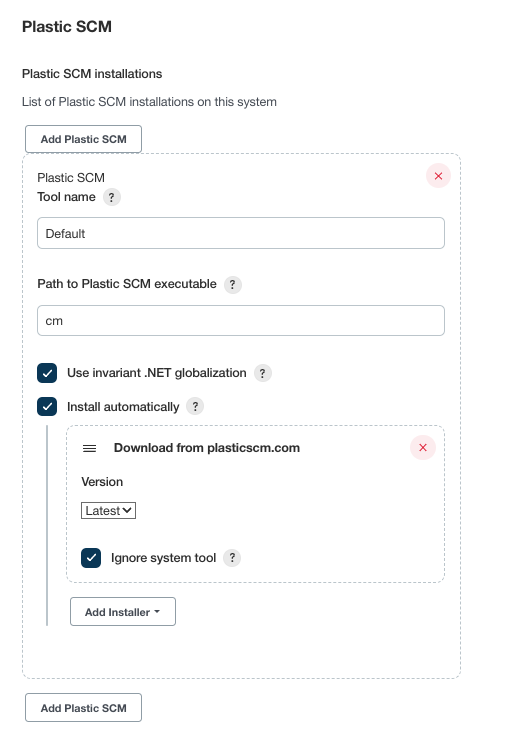

# External tool configuration

The Plastic SCM plugin for Jenkins requires a working `cm` client to be present in the controller or agent machines.
If it's not, the plugin provides a way for the machines to automatically download and install the client.

To configure the Plastic SCM tool in Jenkins, open the system configuration page "Manage Jenkins" and navigate to
"Global Tool Configuration".

Scroll down to the "Plastic SCM" section. There will be a default entry called "Default". It will expect a `cm` binary
to be present in the controller or agents. If it's not, it will download it from [plasticscm.com](https://www.plasticscm.com/).

You can change the name to whatever you want. If there isn't any tool called "Default", the plugin will use the first
one in the list.

The field "Path to Plastic SCM executable" can be either an executable name or a full path. If you specify just the name,
the plugin will use the `$PATH` environment variable to run it. Leaving this field empty will use the `cm` default value.

You can optionally enable the Use .NET invariant globalization option if you're using the newer .NET Core CLI client
in Linux machines or containers that don't have the ICU packages installed.

The "Install automatically" option is checked by default, and the plugin automatically provides an installer to download
the `cm` client bundle from [plasticscm.com](https://www.plasticscm.com/) automatically. However, that installer will
**not** run if it detects that the tool defines a valid `cm` for the target machine. You can optionally override that by
checking the "Ignore system tool" option.

This automatic installer will save the tool bundle contents under `$JENKINS_ROOT/tools/plasticscm/$TOOL_NAME`.

At this point, the plugin is only capable of downloading the latest version available in the Plastic SCM website.

