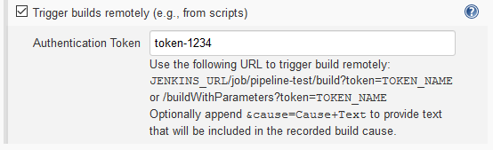

# Mergebot mode

This mode is intended to be used in conjunction with the
[Plastic SCM Mergebot](https://blog.plasticscm.com/2018/09/mergebot-story-of-our-devops-initiative.html) feature.

A Mergebot will trigger a CI build, which will be requested to Jenkins via a Plug. The targeted Jenkins project will
need to have the Plastic SCM plugin configured in Mergebot mode. The plugin will then download the sources to the
workspace, taking the required spec from a build parameter.

## Project configuration

The Jenkins controller and its agents need to have a Plastic SCM client present in their machines or containers.
You can achieve that by defining Plastic SCM as a Jenkins Global Tool. Check our
[External Tool Configuration guide](external-tool-configuration.md) for more information.

### Freestyle projects

First of all, create a new freestyle project and select **Mergebot - Plastic SCM** as the Source Code
Management option:


The _Cleanup_ value will determine what to do with the Plastic SCM workspace before checking out
the code. It has four possible values:

* **Minimal cleanup** will simply undo any changed files in the workspace directory and then run
  a workspace update. It's equivalent to enabling _Use update_ in older versions.
* **Standard cleanup** will undo changed files and also remove any private files that might be
  present in the workspace directory. Ignored files aren't affected. This is the recommended
  setting.
* **Full cleanup** has the same behavior as _Standard cleanup_ but removes ignored files as well.
* **Delete workspace** will remove the entire workspace contents and create a new one. Useful if you
  absolutely want to start every build from scratch. It might increase the build time if your
  workspace is big, though. It's equivalent to disabling _Use update_ in older versions.

You can also define specific credentials to be used by Plastic SCM in the context of the job. You can select the
target working mode, which can be one of these:

* **Use system configuration**
  * Don't specify credentials for this job, rely on an existing `client.conf` file in the machine.
* **User & password**
  * If your targeted Plastic SCM Server uses Plastic SCM user/password authentication, this is the option to choose.
* **LDAP / Cloud**
  * The appropriate choice if your targeted Plastic SCM Server is a Plastic Cloud organization or it uses LDAP as
    authentication provider.

Then, for _User & password_ and _LDAP / Cloud_ you need to specify credentials using the Jenkins Credentials API.

### Pipeline projects

If you use scripted pipelines, or you want to specify the pipeline script directly in the job configuration, you can
take advantage of the `mergebotCheckout()` command inside the groovy script:

####  Command syntax

```groovy
mergebotCheckout cleanup: '<cleanup-strategy>', credentialsId: '<credentials-id>', workingMode: '<working-mode>'
```

The available values for `cleanup` are `MINIMAL`, `STANDARD`, `FULL` and `DELETE`.

In case you want to specify credentials, the available values for `workingMode` are `NONE` (default), `UP` and `LDAP`.

#### Command examples

```groovy
mergebotCheckout cleanup: 'DELETE', workingMode: 'UP', credentialsId: 'my-credentials'

mergebotCheckout cleanup: 'STANDARD'
```

Pipeline example:

```groovy
node {
  def mvnHome
  stage('Preparation') { // for display purposes
      // Get code from Plastic SCM as specified in the build parameters
      mergebotCheckout workingMode: 'UP', credentialsId: 'my-credentials'

      // Get the Maven tool.
      // ** NOTE: This 'M3' Maven tool must be configured
      // **       in the global configuration.
      mvnHome = tool 'M3'
    }

  stage('Build') {
      // Run the maven build
      if (isUnix()) {
        sh "'${mvnHome}/bin/mvn' -Dmaven.test.failure.ignore clean package"
      } else {
        bat(/"${mvnHome}\bin\mvn" -Dmaven.test.failure.ignore clean package/)
      }
  }

  stage('Results') {
      junit '**/target/surefire-reports/TEST-*.xml'
      archive 'target/*.jar'
  }
}
```

You can also choose to retrieve the script from the Plastic SCM changeset to build. Select "Pipeline
script from SCM" as the Definition value in the Pipeline section. Then, choose "Mergebot Plastic SCM"
as the SCM value. You can also specify the file path to find the Jenkinsfile. If you enable the
Lightweight checkout, the plugin will only retrieve that file. Otherwise, the plugin will perform a
complete checkout of the target changeset to load it.


### Enable remotely triggered builds

To allow Plastic SCM to trigger builds in your Jenkins plan, be sure to check the option "Trigger
builds remotely" in the "Build triggers" section of the plan configuration.



## Setup in Plastic SCM

You can configure the Jenkins plug parameters from the WebAdmin. First, create a new Jenkins plug configuration:


Then, select that new configuration as the CI plug of a **mergebot** configuration:


At this point, the **mergebot** will automatically trigger Jenkins builds. You don't need to
worry about this anymore!

## Build parameters & environment variables

These are the build parameters set by [TrunkBot](https://github.com/PlasticSCM/trunk-mergebot) when
it triggers a build. They're injected as environment variables so the build steps can use them in
their processes.

Please bear in mind that only the `PLASTICSCM_MERGEBOT_UPDATE_SPEC` value is mandatory. The rest
depend on the particular implementation of the mergebot. If you're using a custom mergebot you can
define your own build parameters.

We'll refer to the changeset being built in a given build as the "current changeset".

* `PLASTICSCM_MERGEBOT_UPDATE_SPEC`: the target object to check out. It can be a shelveset spec, a branch
  spec, a label spec or a changeset spec.
    * The `plasticscm-mergebot-plugin` **requires** this build parameter.
* `PLASTICSCM_MERGEBOT_BRANCH_HEAD_CHANGESET_AUTHOR`: the name of the user who created the current changeset.
* `PLASTICSCM_MERGEBOT_BRANCH_HEAD_CHANGESET_NUMBER`: the number (also known as ChangesetID) of the
  current changeset.
* `PLASTICSCM_MERGEBOT_BRANCH_HEAD_CHANGESET_GUID`: the GUID of the current changeset.
* `PLASTICSCM_MERGEBOT_BRANCH_NAME`: the branch name of the current changeset.
* `PLASTICSCM_MERGEBOT_TRUNK_HEAD_CHANGESET_NUMBER`: the target changeset number to merge the current
  changeset if the build is successful.
* `PLASTICSCM_MERGEBOT_TRUNK_HEAD_CHANGESET_GUID`: the target changeset GUID to merge the current
  changeset if the build is successful.
* `PLASTICSCM_MERGEBOT_REPSPEC`: the repository where the current changeset is stored.
* `PLASTICSCM_MERGEBOT_TASK_NUMBER`: the issue identifier related to the branch of the current changeset.
